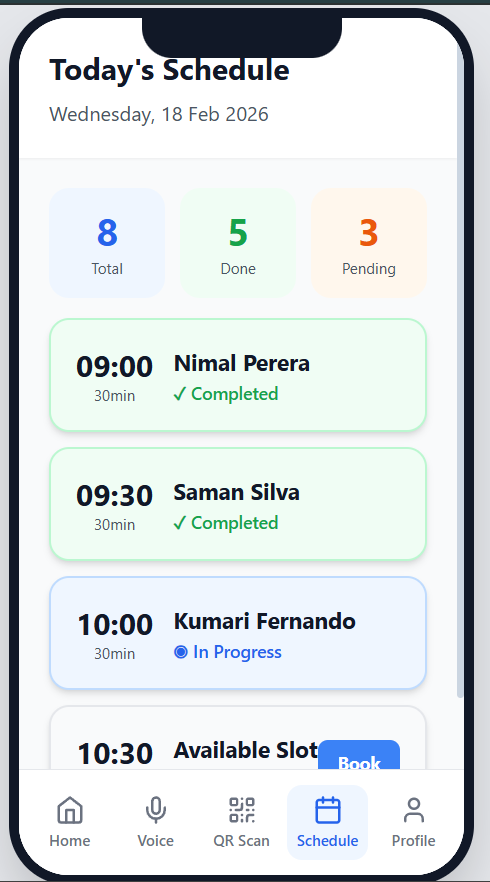
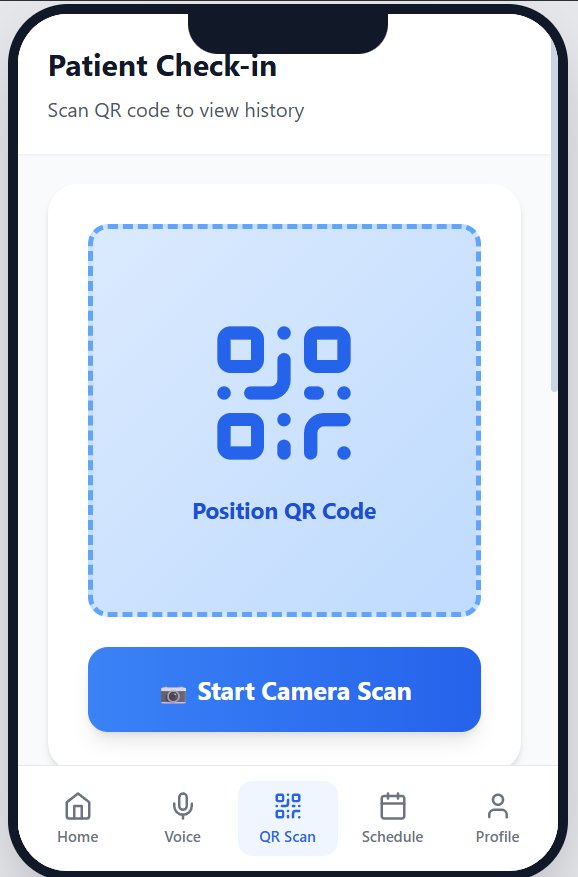
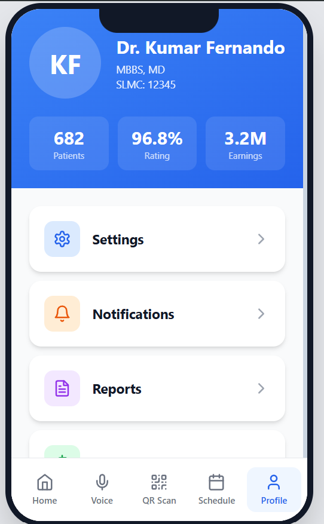
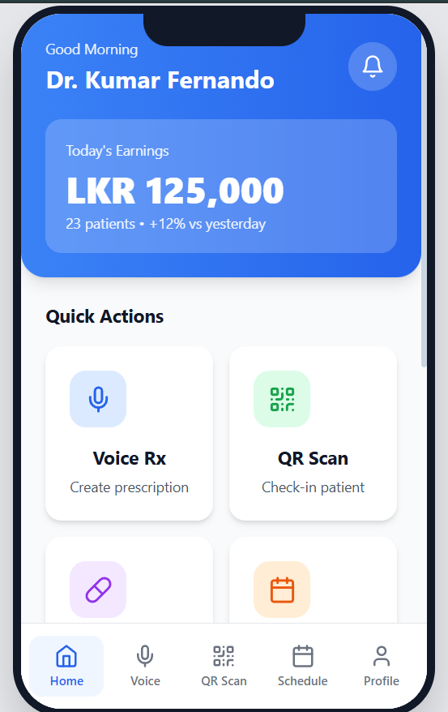
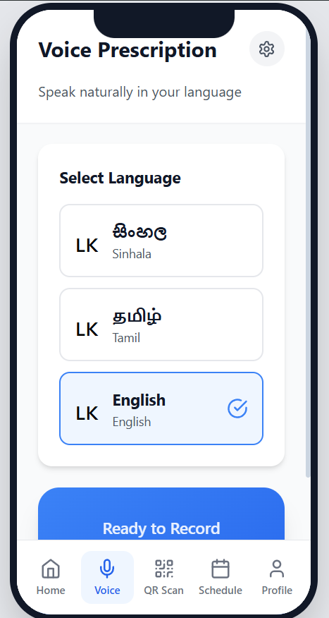

# Enhanced Consultant Management System (ECMS)

> IT 3008 IT Seminar · Group 02 · 2026
> Supervised by Dr. Prabhath Liyanage

A mobile-first healthcare platform prototype for Sri Lankan medical consultants, featuring appointment scheduling, QR-based patient check-in, voice-powered e-prescriptions, real-time payment tracking, and daily earnings analytics.

---

## Screenshots

| Home Dashboard | Voice Prescription |
|---|---|
|  |  |

| QR Check-in | Daily Schedule |
|---|---|
|  |  |

| Doctor Profile |
|---|
|  |

---

## Tech Stack

| Layer | Technology |
|---|---|
| UI Framework | React 18 |
| Bundler | Vite 5 |
| Styling | Tailwind CSS 3 |
| Icons | Lucide React |
| CI/CD | GitHub Actions |
| Hosting | GitHub Pages |

---

## Getting Started

```bash
git clone https://github.com/Isuruigi/ecms-prototype.git
cd ecms-prototype
npm install
npm run dev
```

Open http://localhost:5173

---

## Team

| Name | Index No | Role |
|---|---|---|
| I.G.I. Chathuranga | S16847 | Project Lead & UI Developer |
| H.J. Jayawardhana | S16842 | Feature Analyst |
| G.S. Vignesh | S16763 | Backend / Payment Module |
| C.M.D.D. Silva | S16743 | Clinical Systems Designer |
| M.V.T. Lakruwan | S16989 | QR & Records Module |

**Supervised by:** Dr. Prabhath Liyanage · IT 3008 IT Seminar

---

*Group 02 · Enhanced Consultant Management System · IT 3008 IT Seminar · 2026*
